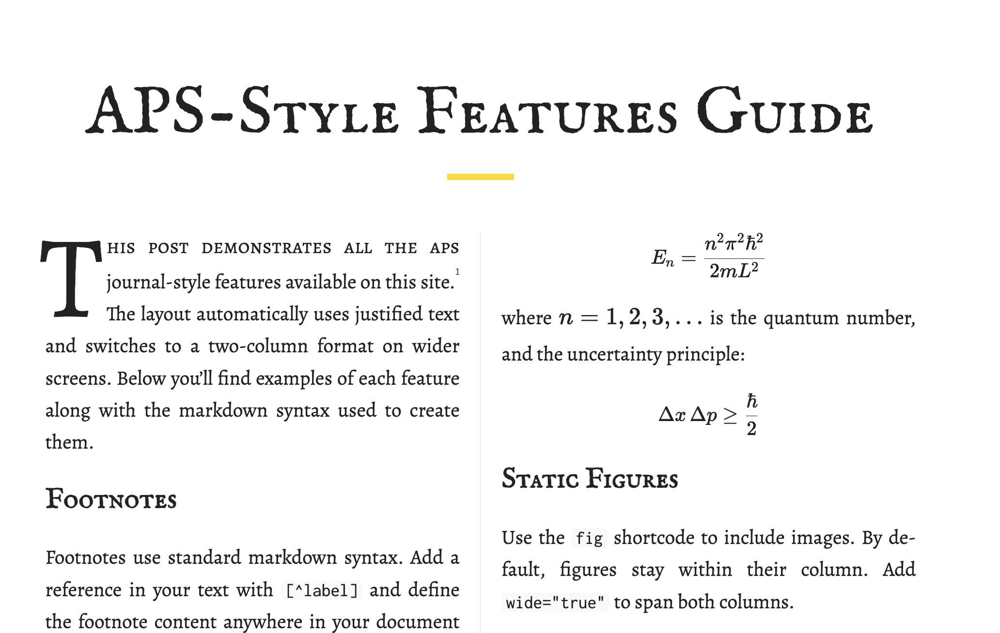

<a id="readme-top"></a>

[![Contributors][contributors-shield]][contributors-url]
[![Forks][forks-shield]][forks-url]
[![Stargazers][stars-shield]][stars-url]
[![Issues][issues-shield]][issues-url]
[![MIT License][license-shield]][license-url]

<br />
<div align="center">
  <h1>APS Journal Theme</h1>
  
  <p>
    A Hugo theme for academic and journal-style publishing, inspired by American Physical Society formatting.
    <br />
    <br />
    <a href="https://github.com/PersephoneKarnstein/Hugo-APS-Journal/issues/new?labels=bug">Report Bug</a>
    &middot;
    <a href="https://github.com/PersephoneKarnstein/Hugo-APS-Journal/issues/new?labels=enhancement">Request Feature</a>
  </p>
</div>

<details>
  <summary>Table of Contents</summary>
  <ol>
    <li>
      <a href="#about-the-project">About The Project</a>
      <ul>
        <li><a href="#features">Features</a></li>
        <li><a href="#built-with">Built With</a></li>
      </ul>
    </li>
    <li>
      <a href="#getting-started">Getting Started</a>
      <ul>
        <li><a href="#prerequisites">Prerequisites</a></li>
        <li><a href="#installation">Installation</a></li>
      </ul>
    </li>
    <li>
      <a href="#usage">Usage</a>
      <ul>
        <li><a href="#configuration">Configuration</a></li>
        <li><a href="#shortcodes">Shortcodes</a></li>
        <li><a href="#front-matter">Front Matter</a></li>
      </ul>
    </li>
    <li><a href="#contributing">Contributing</a></li>
    <li><a href="#license">License</a></li>
  </ol>
</details>

## About The Project

APS Journal is a Hugo theme designed for academic writing, technical blogs, and journal-style publishing. It features a sophisticated two-column layout, automatic figure numbering, KaTeX math rendering, and a carefully crafted dark/light mode toggle.

### Features

* **Two-Column Layout** - Responsive multi-column design for screens >= 900px, with code blocks and wide figures spanning both columns
* **Dark/Light Mode** - Manual theme toggle with system preference detection and localStorage persistence
* **Math Rendering** - KaTeX integration for inline (`\(...\)`) and display (`\[...\]`) equations
* **Auto Figure Numbering** - Figures with captions are automatically numbered sequentially
* **Table of Contents** - Dynamic sidebar TOC generated from page headings with scroll highlighting
* **Client-Side Search** - Lunr.js powered search with keyboard shortcuts (Ctrl/Cmd+K)
* **Tag Filtering** - Filter posts by tag with URL parameter support (`?tag=tagname`)
* **Drop Caps** - Configurable drop cap styling for article openings
* **Acronym Styling** - Automatic small-caps formatting for acronyms (3+ uppercase letters)
* **Syntax Highlighting** - Monokai theme with line numbers and horizontal scrolling

<p align="right">(<a href="#readme-top">back to top</a>)</p>

### Built With

* [![Hugo][Hugo-badge]][Hugo-url]
* [![SCSS][SCSS-badge]][SCSS-url]
* [![KaTeX][KaTeX-badge]][KaTeX-url]
* [![Lunr.js][Lunr-badge]][Lunr-url]
* [![Font Awesome][FA-badge]][FA-url]

<p align="right">(<a href="#readme-top">back to top</a>)</p>

## Getting Started

### Prerequisites

* Hugo extended version (>= 0.120.0)
  ```sh
  # Check your Hugo version
  hugo version
  ```

### Installation

#### Option 1: Git Submodule (Recommended)

1. Navigate to your Hugo site root
   ```sh
   cd your-hugo-site
   ```

2. Add the theme as a submodule
   ```sh
   git submodule add git@github.com:PersephoneKarnstein/Hugo-APS-Journal.git themes/aps-journal
   ```

3. Update your site's `hugo.toml` or `config.toml`
   ```toml
   theme = "aps-journal"
   ```

#### Option 2: Direct Clone

1. Clone the theme into your themes directory
   ```sh
   git clone git@github.com:PersephoneKarnstein/Hugo-APS-Journal.git themes/aps-journal
   ```

2. Update your site configuration
   ```toml
   theme = "aps-journal"
   ```

<p align="right">(<a href="#readme-top">back to top</a>)</p>

## Usage

### Configuration

Add the following to your `hugo.toml` or `config.toml`:

```toml
[params]
  # Features
  math = true                    # Enable KaTeX math rendering
  search = true                  # Enable client-side search
  tagFilter = true               # Enable tag filtering dropdown

  # Typography
  [params.DropCap]
    Enable = true
    FontSize = "5.8em"

  # Appearance
  CodeColour = "#bf616a"         # Accent color for code
  AccentColour = "#ffd900"       # General accent color
  CodeBackground = "#272822"     # Code block background

  # Content
  SummaryWordLimit = 50          # Word limit for post summaries
  DisplayReadTime = true         # Show reading time on posts
```

### Shortcodes

#### Figure with Caption

```markdown


<!-- Wide figure spanning both columns -->

```

#### Section Break

Creates a titled section divider that affects TOC hierarchy:

```markdown

```

#### Column Break

Force a column break in the two-column layout:

```markdown

```

#### Code Block with Caption

```markdown

function hello() {
  console.log("Hello, world!");
}

```

### Extended Markdown Syntax

This theme extends standard markdown with additional attributes for code blocks and tables.

#### Code Blocks

Code blocks support additional attributes in curly braces after the language identifier:

```markdown
```python {caption="My Script" wide=true linenos=true linenostart=10}
def hello():
    print("Hello, world!")
```⁣
```

| Attribute | Description |
|-----------|-------------|
| `caption` | Adds a caption below the code block |
| `wide` | Makes the block span both columns (default for all code blocks) |
| `linenos` | Enable line numbers |
| `linenostart` | Starting line number (use with `linenos`) |

#### Tables

Tables can be configured using an HTML comment directly before the table:

```markdown
<!-- table: wide=true caption="Comparison of Methods" -->
| Method | Speed | Accuracy |
|--------|-------|----------|
| A      | Fast  | Low      |
| B      | Slow  | High     |
```

| Attribute | Description |
|-----------|-------------|
| `wide=true` | Makes the table span both columns |
| `caption="..."` | Adds a caption below the table |

### Front Matter

```yaml
---
title: "Your Post Title"
date: 2024-01-01
tags: ["tag1", "tag2"]
math: true           # Enable math for this post (if not globally enabled)
columns: 1           # Override to single-column layout
summary: "Custom summary text for the post listing"
---
```

<p align="right">(<a href="#readme-top">back to top</a>)</p>

## Contributing

Contributions are welcome and appreciated.

1. Fork the Project
2. Create your Feature Branch (`git checkout -b feature/AmazingFeature`)
3. Commit your Changes (`git commit -m 'Add some AmazingFeature'`)
4. Push to the Branch (`git push origin feature/AmazingFeature`)
5. Open a Pull Request

<p align="right">(<a href="#readme-top">back to top</a>)</p>

## License

This project is released into the public domain under the Unlicense. See `LICENSE` for more information.

<p align="right">(<a href="#readme-top">back to top</a>)</p>

<!-- MARKDOWN LINKS & IMAGES -->
[contributors-shield]: https://img.shields.io/github/contributors/PersephoneKarnstein/Hugo-APS-Journal.svg?style=for-the-badge
[contributors-url]: https://github.com/PersephoneKarnstein/Hugo-APS-Journal/graphs/contributors
[forks-shield]: https://img.shields.io/github/forks/PersephoneKarnstein/Hugo-APS-Journal.svg?style=for-the-badge
[forks-url]: https://github.com/PersephoneKarnstein/Hugo-APS-Journal/network/members
[stars-shield]: https://img.shields.io/github/stars/PersephoneKarnstein/Hugo-APS-Journal.svg?style=for-the-badge
[stars-url]: https://github.com/PersephoneKarnstein/Hugo-APS-Journal/stargazers
[issues-shield]: https://img.shields.io/github/issues/PersephoneKarnstein/Hugo-APS-Journal.svg?style=for-the-badge
[issues-url]: https://github.com/PersephoneKarnstein/Hugo-APS-Journal/issues
[license-shield]: https://img.shields.io/github/license/PersephoneKarnstein/Hugo-APS-Journal.svg?style=for-the-badge
[license-url]: https://github.com/PersephoneKarnstein/Hugo-APS-Journal/blob/main/LICENSE

[Hugo-badge]: https://img.shields.io/badge/Hugo-FF4088?style=for-the-badge&logo=hugo&logoColor=white
[Hugo-url]: https://gohugo.io/
[SCSS-badge]: https://img.shields.io/badge/SCSS-CC6699?style=for-the-badge&logo=sass&logoColor=white
[SCSS-url]: https://sass-lang.com/
[KaTeX-badge]: https://img.shields.io/badge/KaTeX-009688?style=for-the-badge&logo=latex&logoColor=white
[KaTeX-url]: https://katex.org/
[Lunr-badge]: https://img.shields.io/badge/Lunr.js-2E8B57?style=for-the-badge&logo=javascript&logoColor=white
[Lunr-url]: https://lunrjs.com/
[FA-badge]: https://img.shields.io/badge/Font_Awesome-339AF0?style=for-the-badge&logo=fontawesome&logoColor=white
[FA-url]: https://fontawesome.com/
